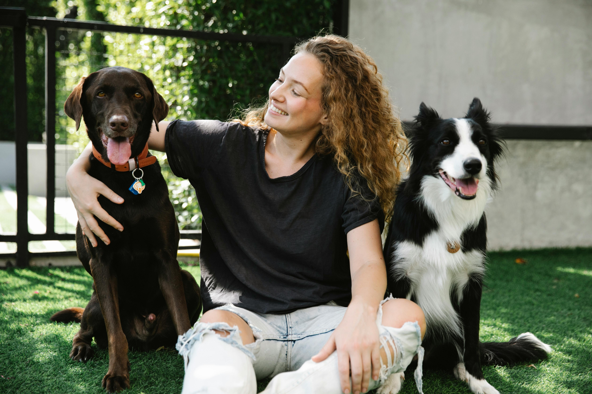
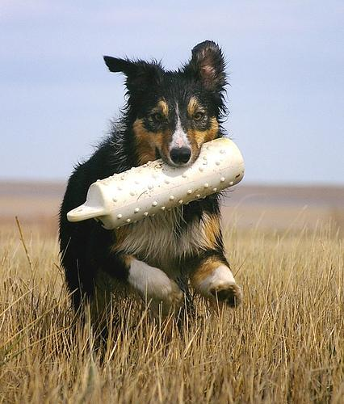

# Trainieren von YOLO mit einem eigenen Datensatz

In diesem Repo wird gezeigt, wie YOLO mit einem eigenen Datensatz trainiert werden kann. Hierfür wird beispielsweiße der Datensatz "Stanford dog dataset" verwendet, es kann jedoch nach dem selben Schema auch andere Datensätze verwendet werden. Der verwendete Datensatz der hier beispielshaft verwendet wird, kann heruntergeladen werden auf Kaggle unter [Stanford dog dataset](https://www.kaggle.com/datasets/jessicali9530/stanford-dogs-dataset). Es wird in diesem Beispiel die YOLO-Version 8 verwendet, weitere Informationen zu YOLO unter [YOLOV8-Repo](https://github.com/ultralytics/ultralytics/tree/main).

## Lizenz

Dieses Programm ist lizenziert unter der MIT Licence, als Beispiel wurde hierfür jedoch das Stanford dod dataset benutzt. Weiterführende Informationen zu der Lizenz als Beispiel verwendeten Datensatzes finden Sie unter [Stanford dog dataset](https://www.kaggle.com/datasets/jessicali9530/stanford-dogs-dataset).

## Ausgangslage

Unser Ziel ist es, die unterschiedlichen Hunderassen auf einem Foto zu erkennen. Als Beispiel verwenden wir das folgende Bild:



Thanks to 'Goochie Poochie Grooming' on [Pexels](https://www.pexels.com/de-de/foto/foto-von-verschiedenen-welpen-3299905/)

Wenn wir nun das Standard-Model von YOLO auf dem Bild anwenden, erkennt YOLO die einzelnen Hunde auf dem Bild: (dies wird in der Datei [Predict_original_yolo_model.py](Predict_original_yolo_model.py) durchgeführt)


Jedoch möchten wir ein Ergebnis wie folgendes:


## Allgemeiner Aufbau der Datensätze

Zunächsteinmal müssen wir uns anschauen, wie YOLO arbeitet bzw. in welchem Format YOLO die Daten benötigt. 

### Aufbau der config.yaml-Datei

Damit YOLO weiß wo die Test-, Train- und Validierungsdatensätze angespeichert sind, gibt es die config.yaml bei der diese Pfade angegeben sind. Des weiteren ist dort noch angegeben wie viele verscheidene Klassen es beim trainieren gibt und wie diese in Klartext heißen. Die Datei ist folgendermaßen aufgebaut:

```yaml
{
  names: [
    Gordon_setter, Blenheim_spaniel, Newfoundland, ...], 
    nc: 120, 
    test: /dataset/test/, # Hier muss evtl. der absolute Pfad angegeben werden
    train: /dataset/train/, # Hier muss evtl. der absolute Pfad angegeben werden
    val: /YoloCustomDataset/dataset/valid/ # Hier muss evtl. der absolute Pfad angegeben werden
}
```

Parameter | Beschreibung | Kommentar
-------- | -------- | --------
names   | Die Liste der einzelnen Klassen in Klartext | Der Name an der 1. Stelle ist der Klassenindex 0, usw.
nc   | Die Anzahl der Klassen im Datensatz (hier der Hunderassen)  | 
test   | Der Pfad zu dem Ordner der Text-Datensätze | Evtl. muss hier der absolute Pfad zu dem Ordner angegenen werden, wenn eine Fehlermeldung von YOLO ausgegeben wird, wenn der Pfad nicht gefunden wird
train   | Der Pfad zu dem Ordner der Trainings-Datensätze   | siehe Parameter 'test'
val   | Der Pfad zu dem Ordner der Validierungs-Datensätze   | siehe Parameter 'test'

### Aufbau der Datensatz-Ordnerstruktur

Die Struktur der Test-, Trainings- und Validierungsdatensätze muss eine gewisse struktur aufweißen. In jeder von diesen muss ein Ordner 'images' für die Bilddateien und ein Ordner 'labels' für die "Metadaten" des Datensatzes vorhanden sein.

### Aufbau eines einzelnen Datensatzes

Ein Datensatz besteht aus einer Bilddatei und einer "Metadaten"-Datei. Die Bilddatei und die "Metadaten"-Datei müssen gleich heißen (die Dateiändung kann natürlich abweichen). Zur Datei "Imag1.jpg" im images-Ordner gehört zum Beispiel die "Image.txt"-Datei im labels-Ordner. Das Bild zum Datensatz ist ein ganz "normales" Bild, die "Metadaten"-Datei muss jedoch eine gewisse struktur aufweißen:

```
0 0.43309859154929575 0.448 0.5328638497652582 0.704
```

Jede Zeile entspricht einem Objekt in dem jeweiligen Bild und jede Zeile wird folgendermaßen aufgebaut:

0 | 0.43309859154929575 | 0.448 | 0.5328638497652582 | 0.704
-------- | -------- | -------- | -------- | --------
Klassen-Index  | X-Position (x)  | Y-Position (y) | Breite des Objekts (b)  | Höhe des Objekts (h)

- Kassenindex: Der Index der Klasse des Objekts aus der config.yaml (in diesem Beispiel 0 == 'Gordon_setter')
- X-Position: X-Position des Mittelpunkts des Objekts zur relativen Breite des Bildes.
- Y-Position: X-Position des Mittelpunkts des Objekts zur relativen Breite des Bildes.
- Breite des Objekts: Die Breite des Objekts relativ zur Breite des Bilder
- Höhe des Objekts: Die Breite des Objekts relativ zur Höhe des Bilder


### Vorbereiten der eigenen Datensätze

Damit wir wissen was wir an unseren Datensätzen anpassen müssen, schauen wir uns zunächst einen Datensatz aus dem [Stanford dog dataset](https://www.kaggle.com/datasets/jessicali9530/stanford-dogs-dataset) an: (hier n02106030_17662.jpg und n02106030_17662 (Text-Datei))



```xml
<annotation>
	<folder>02106030</folder>
	<filename>n02106030_17662</filename>
	<source>
		<database>ImageNet database</database>
	</source>
	<size>
		<width>426</width>
		<height>500</height>
		<depth>3</depth>
	</size>
	<segment>0</segment>
	<object>
		<name>collie</name>
		<pose>Unspecified</pose>
		<truncated>0</truncated>
		<difficult>0</difficult>
		<bndbox>
			<xmin>71</xmin>
			<ymin>48</ymin>
			<xmax>298</xmax>
			<ymax>400</ymax>
		</bndbox>
	</object>
</annotation>
```

Interesannt für uns sind folgende Informationen aus der Textdatei:

Parameter | Beschreibung
-------- | -------- 
folder   | Der Ordnername in der das Bild gespeichert ist
filename | Der Dateiname des Bildes (hier n02106030_17662.jpg)
width | Die Breite des Bildes
height | Die Höhe des Bildes
object | Die Liste der einzelnen Hunde im Datensatz. In diesem Beispiel ist nur ein Hund im Datensatz, es können jedoch mehrere object-Nodes im Datensatz sein
name | Die Hunderasse des Hundes in diesem Objekt
xmin | Die X-Koordinate des Objekts (obere Kante des Objekts)
ymin | Die Y-Koordinate des Objekts (links Kante des Bildes)
xmax | Die X-Koordinate des Objekts (untere Kante des Objekts)
ymax | Die Y-Koordinate des Objekts (rechte Kante des Objekts)

Die einzelnen Parameter des YOLO-Datensatzes können dann folgendermaßen berechnet werden (siehe [Aufbau eines einzelnen Datensatzes](#aufbau-eines-einzelnen-datensatzes)):

$ x = \frac{xmin + \frac{(xmax - xmin)}{2} }{width} $

$ y = \frac{ymin + \frac{(ymax - ymin)}{2} }{height} $

$ b = \frac{(xmax - xmin)}{width} $

$ h = \frac{(ymax - ymin)}{height} $

Der Index des einzelnen Objekts dann z.B. bestimmt werden, durch den Index in einer Liste inder die ganzen Hunderassen gespeichert werden.

Mit diesen Angaben können die einzelnen Datensätze im YOLO-Format generiert werden. Die Konvertierung wird in der Datei [Prepare_custom_dataset.py](Prepare_custom_dataset.py) durchgeführt.

## Schritt für Schritt Anleitung zum Trainieren mit dem Datensatz

1. Clonen des Projekts und installieren der requirements in der venv.

2. Herunterladen des Datensatzes [Stanford dog dataset bei Kaggle](https://www.kaggle.com/datasets/jessicali9530/stanford-dogs-dataset)

3. Entpacken des Datensatzes und speichern des Datensatzes im Ordner "data" ( --> die Ordner 'annotaions' und 'images' müssen direkt unter 'data' sein)

4. Ausführen der Datei [Prepare_custom_dataset.py](Prepare_custom_dataset.py) um die Daten fürs Training vorzubereiten. Danach müssen evtl. die Pfade in der config.yaml auf absolute Pfade angepasst werden.

5. Durchführen des Trainings ([TrainYolo.py](TrainYolo.py)) (kann etwas länger brauchen)

6. Überprüfen des Trainingsergebnis mit dem Testbild mit ([Predict_custom_yolo_model.py](Predict_custom_yolo_model.py))


